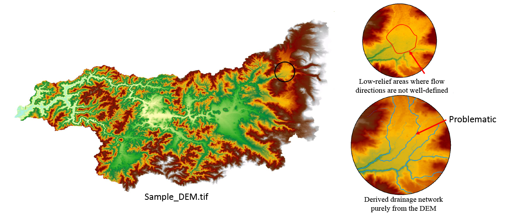
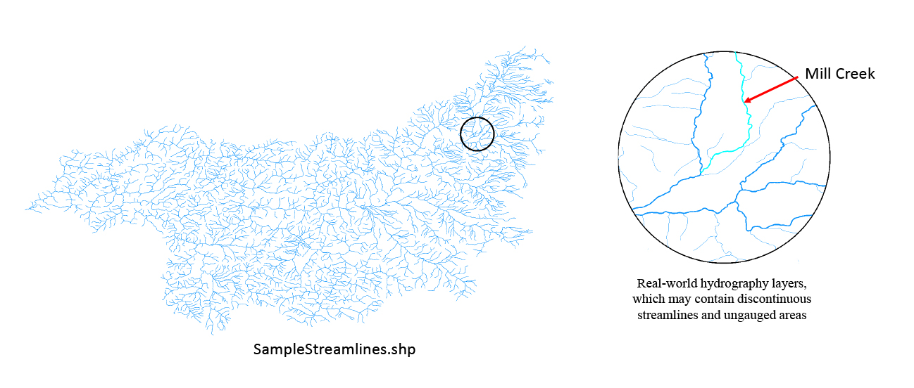
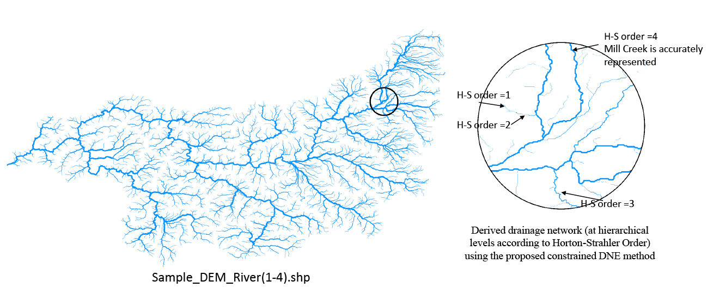
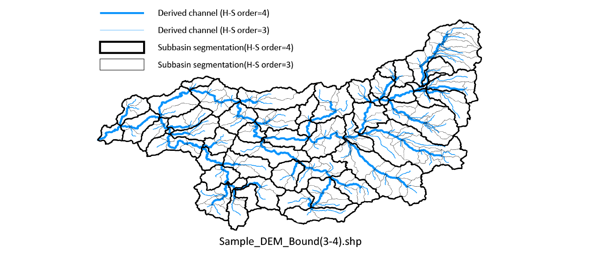

## An enhanced Drainage Network Extraction (DNE) program constrained by a flow enforcement procedure

This program is used for drainage network extraction from gridded digital elevation model (DEM) data, while real flow-path information obtained from river maps (i.e., hydrography layers in vector data formats) are also incorporated through an enhanced flow enforcement procedure towards achieving more accurate DNE results. The core algorithm of this program is described in a research paper of Wu et al. entitled _High-efficient extraction of drainage networks from digital elevation model data constrained by enhanced flow enforcement from known river maps_, which is pursuing publication in the journal of _Geomorphology_.
 
The constrained DNE program provides an alternative for the common elevation-based stream-burning tools (which are used to solve some well-acknowledged DNE-related issues in low-relief areas where flow directions are hard to define purely according to the DEM). Rather than modifying the elevation values of the DEM cells along the known streams, the enhanced flow enforcement procedure use a different strategy to constrain the derive flows within/along the mapped streams in the framework of the Priority-Flood algorithm: By applying a modified priority metric and path constraints, flows are enforced to completely follow the mapped streamlines.
 
The program takes the advantages of both the DEM data and the mapped data, and hence can derive very accurate watershed partitions and almost identical channel delineations with the mapped streamlines. Also note that the program ensures scale-consistent performance with various DEM resolutions, and hence may be particularly useful to wide-ranging analyses in which the used DEMs are usually of coarse or medium resolutions.

The DNE program, coded in C++ language, adopts the state-of-the-art least-cost-path-search method (i.e., the Priority-Flood algorithm; see [Wang and Liu (2006)](https://www.tandfonline.com/doi/abs/10.1080/13658810500433453) and [Barnes et al. (2014)](https://www.sciencedirect.com/science/article/pii/S0098300413001337) for reference) as the framework, and are implemented based on a high-efficient DNE implementation (see publication: [Bai R, Li T, Huang Y, et al. An efficient and comprehensive method for drainage network extraction from DEM with billions of pixels using a size-balanced binary search tree. Geomorphology, 2015, 238:5667](https://www.sciencedirect.com/science/article/pii/S0169555X15001233)) using a size-balanced binary search tree. This uploaded project (in the /ConstrainedDNE folder) was created by Mircosoft Visual Studio 2015, and some Microsoft library functions are used. If a user needs to use the source code in other environments, some minor alterations should be made.

### Usage

A compiled Windows exe file can be found in the /Sample/Exe folder.

The program runs in the command line mode. 

There are three input parameters in all, including _DEM_data_file_path_, _Streamlines_file_path_, and _Critical_upslope_contributing_area_. _Critical_upslope_contributing_area_ is an integer for channel head determination; for example, if this parameter is set to be 250, it means cells with flow accumulation values over 250 should be considered as channel cells. 

	[ConstrainedDNE.exe] [DEM_data_file_path] [Streamlines_file_path] [Critical_upslope_contributing_area] 
	
	Examples:
	ConstrainedDNE.exe SampleDEM.tif SampleStramlinesFile.tif 250 

__Notice__: The program will create a folder named same as the input DEM file and save the result file in it. The input DEM is required to be in the uncompressed TIFF format. The streamlines file is required to be in the Shapefile format, and each streamline should have a sequential order (see the paper of Wu et al., for definition). The outputs contain derived drainage networks (at hierarchical levels according to Horton-Strahler Order) and corresponding upslope area boundaries (also at hierarchical levels). 

|#|Input & Output|Figures|
|:---:|:---:|:---:|
|1|Input: DEM data (.tif file, uncompressed format)||
|2|Input: Streamlines data for flow enforcement (.shp polyline file)||
|3|Output: Derived drainage network (.shp polyline file)||
|4|Output: corresponding upslope area boundaries (.shp polygon file)||

### Statement

The program is completed by the group led by Prof. Guangqian Wang at the [State Key Laboratory of Hydroscience and Engineering](http://sklhse.tsinghua.edu.cn/) and also the [Department of Hydraulic Engineering](http://www.civil.tsinghua.edu.cn/en/he/) at [Tsinghua University](http://www.tsinghua.edu.cn/publish/newthuen/index.html). The copyright of this program belongs to Tsinghua University. The program and its associated source codes are allowed to be used for scientific research purposes only and not for commercial uses without asking permission. 

For more details, please contact Mr. Tao Wu (wutao93.dhe@gmail.com) or Dr. Tiejian Li (litiejian@tsinghua.edu.cn). 

